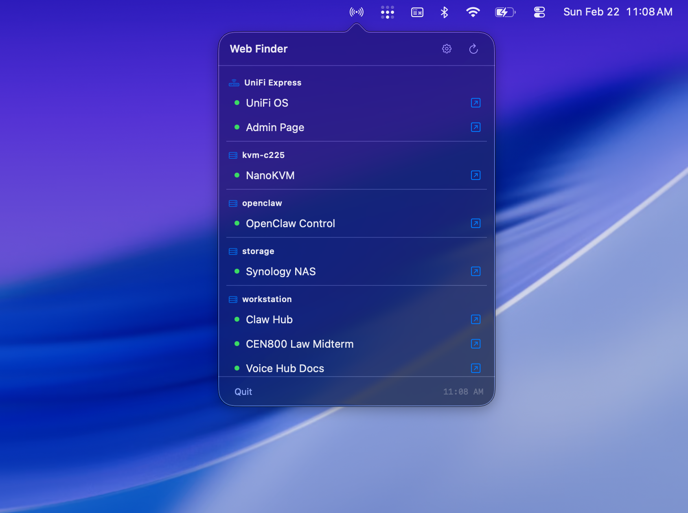
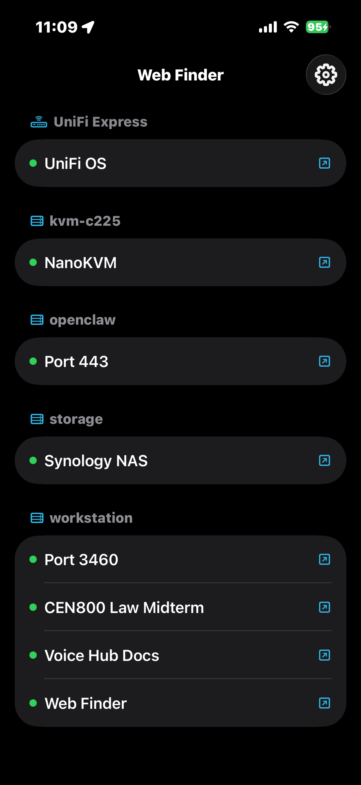
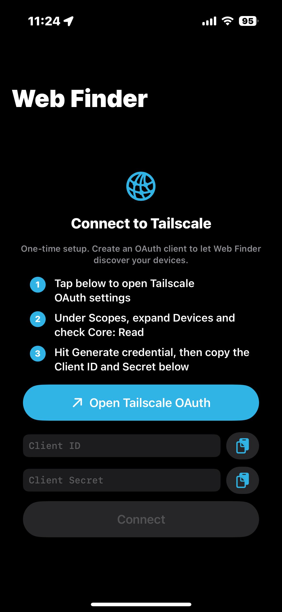

# WebFinder for Tailscale

**Find web interfaces across your tailnet.**

Stop bookmarking admin pages, docs sites, homelab dashboards, and test builds. WebFinder for Tailscale discovers web services published by WebFinder clients on your Tailscale devices, plus local services on the machine running it. Fully free and open source.

**[zeulewan.github.io/web-finder](https://zeulewan.github.io/web-finder/)**

## macOS

Menubar app for Tailscale users. It shows discovered web services at a glance, opens them in your browser, and auto-refreshes every 60 seconds.



## iOS

Discovers services published by WebFinder clients on your tailnet. One-time Tailscale OAuth setup. Install WebFinder on each Mac/Linux device you want to see, then run `web-finder start` there.

Available on the [App Store](https://apps.apple.com/app/web-finder-for-tailscale/id6759476914) (free).

<p>
  
  &nbsp;&nbsp;
  
</p>

## Install

On macOS, install the signed and notarized menu bar app with Homebrew:

```bash
brew install --cask zeulewan/tap/webfinder
```

To install the CLI and publish this Mac/Linux device's local web services to your tailnet, use the installer:

```bash
curl -sSL https://raw.githubusercontent.com/zeulewan/web-finder/main/install.sh | bash
```

Then start sharing that device:

```bash
web-finder start
```

That starts the local manifest server at boot and publishes detected local web UIs through Tailscale Serve. Remote WebFinder clients fetch that manifest instead of port-scanning your peers.

Release and App Store submission notes for maintainers live in [docs/release.md](docs/release.md).

To uninstall:

```bash
curl -sSL https://raw.githubusercontent.com/zeulewan/web-finder/main/uninstall.sh | bash
```

## CLI

```bash
web-finder                   # Find local services and Tailscale-published peer services
web-finder start             # Start sharing this machine over Tailscale Serve at boot
web-finder stop              # Stop sharing and disable boot autostart
web-finder status            # Check daemon, Tailscale Serve, MagicDNS, and version
web-finder update            # Pull latest version and restart sharing
web-finder version           # Show version
web-finder --json            # JSON output for apps/scripts
web-finder --debug           # Noisy diagnostics, all open ports, and no-service peers
```

## How discovery works

WebFinder for Tailscale is intentionally Tailscale-first:

- Each Mac/Linux device scans only itself.
- `web-finder start` publishes a small manifest at `/.well-known/web-finder.json` on port `9321`.
- Tailscale Serve exposes that manifest and the discovered service URLs to your tailnet.
- Other clients fetch peer manifests instead of scanning peer ports.
- Normal output hides protocol/API-only ports and peers with no services. Use `web-finder --debug` for the noisy view.

Remote services only appear after WebFinder is installed and started on the peer.

## Development

```bash
npm install --prefix cli
npm run check
```

`npm run check` runs ESLint for the CLI, SwiftLint for the macOS/iOS sources, Node syntax checks, and shell syntax checks.
