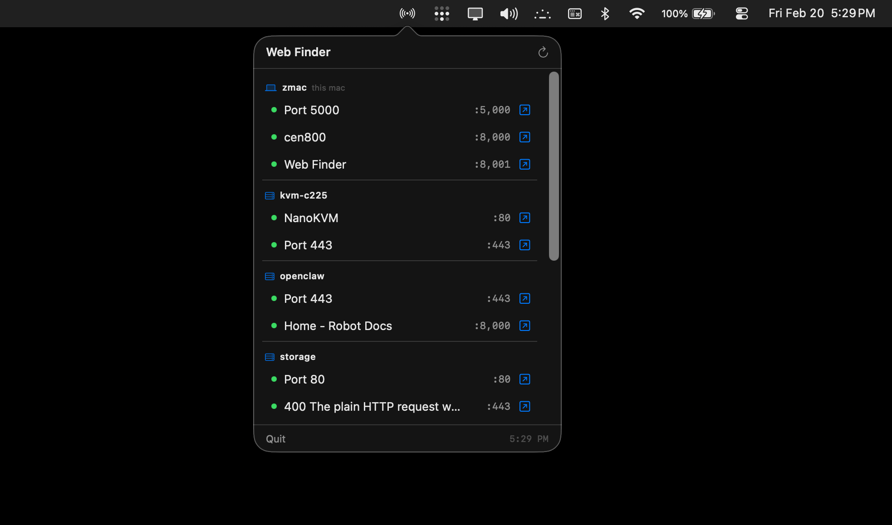

# Web Finder

Find web interfaces running across your Tailscale network.

**[zeulewan.github.io/web-finder](https://zeulewan.github.io/web-finder/)**



## Install

```bash
curl -sSL https://raw.githubusercontent.com/zeulewan/web-finder/main/install.sh | bash
```

Also available on the [App Store](https://apps.apple.com/app/web-finder-for-tailscale/id6759476914) for iOS.

## CLI

```bash
web-finder                   # Full scan, web interfaces only
web-finder --all             # Include non-web ports (SSH, AirPlay, etc.)
web-finder --local           # Local machine only
web-finder --tailscale       # Tailscale peers only
web-finder --json            # JSON output
```

## Project Structure

```
macos/    Menubar app (Swift)
ios/      iOS app (Swift)
cli/      CLI (Node.js)
docs/     Website
```
