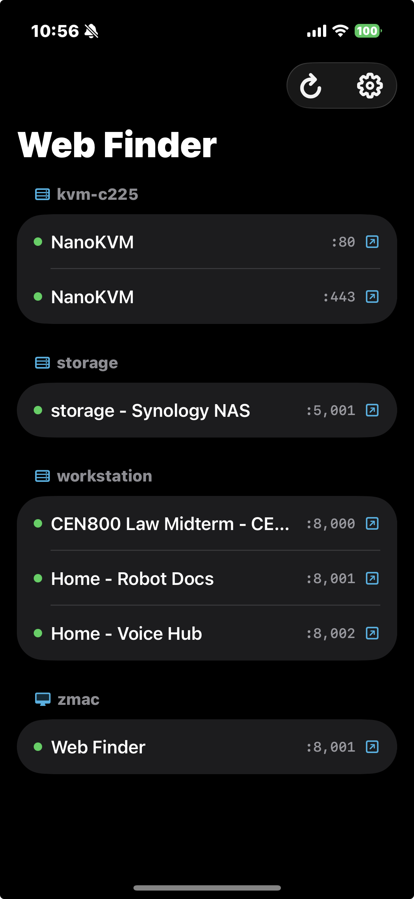
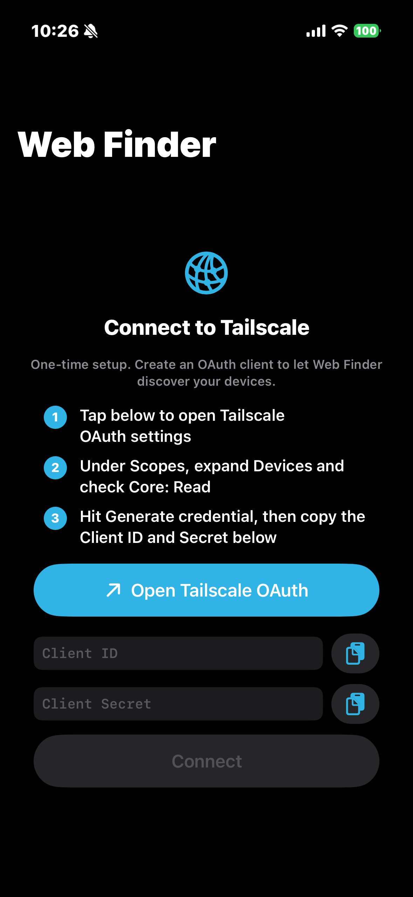

# Web Finder

**Find web interfaces across your network.**

Stop bookmarking admin pages, docs sites, and test builds. Web Finder discovers every web service on your Tailscale peers, one click away.

**[zeulewan.github.io/web-finder](https://zeulewan.github.io/web-finder/)**

## macOS

Menubar app that shows all discovered web services at a glance. Click any service to open in your browser. Auto-refreshes every 60 seconds.


## iOS

Scans your Tailscale peers from anywhere. One-time OAuth setup, credentials never expire.

Available on the [App Store](https://apps.apple.com/app/web-finder-for-tailscale/id6759476914) (free).

<p>
  
  &nbsp;&nbsp;
  
</p>

## Install

```bash
curl -sSL https://raw.githubusercontent.com/zeulewan/web-finder/main/install.sh | bash
```

Works on macOS (menubar app + CLI) and Linux (CLI, auto-installs Node.js if missing).

To uninstall:

```bash
curl -sSL https://raw.githubusercontent.com/zeulewan/web-finder/main/uninstall.sh | bash
```

## CLI

```bash
web-finder                   # Full scan, web interfaces only
web-finder --all             # Include non-web ports (SSH, AirPlay, etc.)
web-finder --local           # Local machine only
web-finder --tailscale       # Tailscale peers only
web-finder --json            # JSON output
```

## What it scans

TCP-scans common ports, fetches HTTP `<title>` tags, and identifies running services. Catches dev servers, NAS UIs, Jupyter notebooks, Grafana, Prometheus, Gradio, and anything else serving a web page.

```
80  443  3000  3001  4000  4001  5000  5001  6006  7860
8000-8005  8080-8082  8443  8888  9000  9001  9090  9443
```
